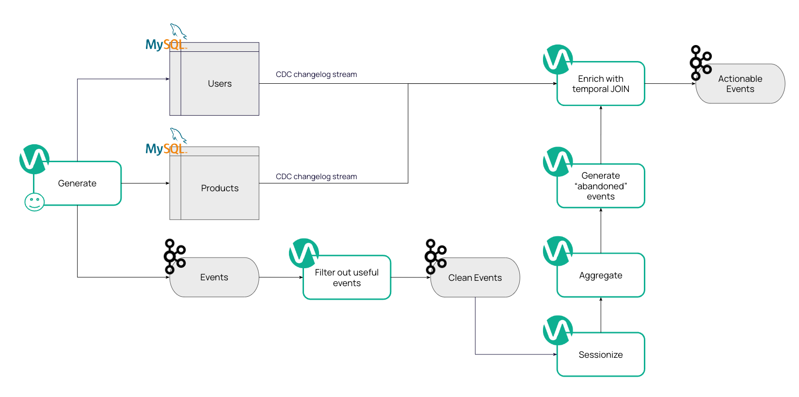

# Use Case

## Pre

Your VM IP is `<insert-vm-ip>`.

```console
ssh dduser??@<insert-vm-ip>
```

SSH into the machine, `env | grep DD` and add secrets in VVC:

 - `dd_kafka_uri`: `...`
 - `dd_mysql_uri`: `...`
 - `dd_mysql_password`: `FFdd_2024`
 - `dd_user`: `<your-user>`

And create your session cluster with minimal configuration.

## Let's do it

<p align="center">
    
</p>

On VVC run `ddl-vvc-base.sql`.

> UI exploration on VVC: catalogs and tables...

Ingest data into Kafka by running `job-vvc-ingest.sql`.

Now check:
 - Your topic on Kafka UI and see new messages
 - Your DB from the VM: `ddmysql -e 'SELECT * FROM users; SELECT * FROM products;'`

You can also run `SELECT` queries in VVC to verify you can consume data from the tables using the debug mode
(suggestion: create a new draft to use as a work sheet):

```sql
USE CATALOG `system`;
USE deepdive2;

SELECT * FROM users;
SELECT * FROM products;
SELECT * FROM events;
```

You can even create a new job in VVC and deploy:

```sql
CREATE TEMPORARY TABLE print WITH (
    'connector' = 'print'
) like `system`.deepdive2.users (EXCLUDING ALL);

INSERT INTO print
SELECT id, first_name, last_name, address, updated_at
FROM `system`.deepdive2.users;
```

To see the changelog of a table:

```
-U[49, Gorgeous Rubber Car, 2024-09-16T13:38:09]
+U[49, Durable Rubber Knife, 2024-09-16T13:38:08]
-U[66, Gorgeous Copper Hat, 2024-09-16T13:36:57]
+U[66, Rustic Wooden Keyboard, 2024-09-16T13:38:08]
+I[23, Fantastic Iron Bench, 2024-09-16T13:38:10]
-U[3, Small Rubber Plate, 2024-09-16T13:37:05]
+U[3, Rustic Wool Coat, 2024-09-16T13:38:16]
-U[13, Intelligent Linen Bottle, 2024-09-16T13:36:55]
+U[13, Aerodynamic Linen Pants, 2024-09-16T13:38:11]
```

> Showcase the event types and explain why we need filtering later...

Now, let's filter out the events for purchases, as we are not interested in `view`s.  
Run this DDL:

```sql
CREATE TABLE IF NOT EXISTS `system`.deepdive2.events_clean WITH (
    'connector' = 'kafka',
    'topic' = '${secret_values.dd_user}.events_clean',
    'format' = 'json',
    'properties.bootstrap.servers' = '${secret_values.dd_kafka_uri}:9092',
    'key.format' = 'raw',
    'key.fields' = 'user_id',
    'properties.group.id' = '${secret_values.dd_user}.group.events_clean',
    'scan.startup.mode' = 'group-offsets',
    'properties.auto.offset.reset' = 'latest'
) LIKE `system`.deepdive2.events (
    EXCLUDING ALL
    INCLUDING WATERMARKS
);
```

Run an `INSERT INTO` statement and filter only for events that have `event_type=purchase` or `event_type=cart`:

```sql
INSERT INTO `system`.deepdive2.events_clean
SELECT * FROM `system`.deepdive2.events
WHERE event_type='purchase' OR event_type='cart';
```

Verify you can read events from the topic:

```sql
SELECT * FROM `system`.deepdive2.events_clean;
```

We finally want to conduct an abandoned cart analysis.  
For each user and session we would like to find if something was left in the cart.  
We aim at sending emails to users with:

```
Hello Mr. Squirrel!
We saw you where interested in product XYZ, but you did not buy it!
Do you want to buy now?
```

Ideally we would like to obtained these information:
 - full name of the user
 - email address
 - product name

Here is how we will store the entries to notify users:

```sql
CREATE TABLE IF NOT EXISTS `system`.deepdive2.abandoned (
    user_id INT,
    full_name STRING,
    email STRING,
    `address` STRING,
    product_id INT,
    product_name STRING,
    last_updated TIMESTAMP(3),

    WATERMARK FOR last_updated AS last_updated
) WITH (
    'connector' = 'kafka',
    'topic' = '${secret_values.dd_user}.abandoned',
    'format' = 'json',
    'properties.bootstrap.servers' = '${secret_values.dd_kafka_uri}:9092',
    'key.format' = 'raw',
    'key.fields' = 'user_id',
    'scan.startup.mode' = 'group-offsets',
    'properties.auto.offset.reset' = 'latest'
);
```

But now, let's make the data analysis to fill the above table!

Let's divide the data in sliding windows to simulate a user session:

```sql
CREATE TEMPORARY VIEW sessioned_events AS
SELECT *
FROM TABLE(
    HOP(
        DATA => TABLE `system`.deepdive2.events_clean,
        TIMECOL => DESCRIPTOR(event_time),
        SIZE => INTERVAL '1' MINUTE, -- dummy value to see results quickly
        SLIDE => INTERVAL '10' SECONDS -- dummy value to see results quickly
    )
);

SELECT * FROM sessioned_events;
```

We can finally group the data by sessions, users, and products.  
In this way, for each session and user we will obtain the events for each product!
At this point it will be enough to get the `event_type`s in order to identify cases
for which a user added a product to the cart, but did not buy it!

The query looks like this:

```sql
SELECT window_start, window_end, window_time as rowtime, user_id, product_id, SOMEAGG(event_type) AS e
FROM sessioned_events
GROUP BY window_start, window_end, window_time, user_id, product_id;
```

We need to put an actual aggregate function instead of `SOMEAGG`, how?
UDFs come to rescue! Navigate to `src/main/java/com/ververica/udfs/ArrayListAggFunction.java` and view the code of the UDF.
It is a simple aggregate function that collects an element into an array list if it's not already in there.

Let's create an executable `jar` file with the UDF.

```sh
mvn clean package
```

Under the `targets` folder you should see a `jar` file called `ververica-flink-sql-training-0.1.0.jar`.
Use the tab UDFs in your VVC console to add the function and name it `arrayagg`.  
You can run `SHOW FUNCTIONS` too see your new function.

Finally, we can run this:

```sql
CREATE TEMPORARY VIEW agg_events AS
SELECT window_start, window_end, window_time as rowtime, user_id, product_id, arrayagg(event_type) AS e
FROM sessioned_events
GROUP BY window_start, window_end, window_time, user_id, product_id;

SELECT * FROM agg_events;
```

Now we want to use the previous query as the basis to reason about abandoned products:  
if the aggregated array contains `cart` and not `purchase`, then we have an abandoned item!  
Use Flink's `IF` and `ARRAY_CONTAINS` build-in function to implement the `abandoned` logic:

```sql
CREATE TEMPORARY VIEW w_abandoned AS
SELECT *, IF(ARRAY_CONTAINS(e, 'cart') AND NOT ARRAY_CONTAINS(e, 'purchase'), 1, 0) AS abandoned
FROM agg_events;

SELECT * FROM w_abandoned;
```

Now you can finally filter:

```sql
CREATE TEMPORARY VIEW abandoned_carts AS
SELECT * FROM w_abandoned
WHERE abandoned = 1;

SELECT * FROM abandoned_carts;
```

Before storing the results to the final table, we need the user full name and the product name.
What do we need? A `JOIN`! More precisely, a _temporal_ `JOIN`:

```sql
CREATE TEMPORARY VIEW abandoned_enriched AS
SELECT
    u.id AS user_id,
    CONCAT_WS(' ', u.first_name, u.last_name) AS full_name,
    u.email,
    u.address,
    p.id AS product_id,
    p.name AS product_name,
    PROCTIME() AS last_updated
FROM abandoned_carts AS a
JOIN `system`.deepdive2.users FOR SYSTEM_TIME AS OF a.rowtime AS u ON a.user_id = u.id
JOIN `system`.deepdive2.products FOR SYSTEM_TIME AS OF a.rowtime AS p ON a.product_id = p.id;

INSERT INTO `system`.deepdive2.abandoned SELECT * from abandoned_enriched;
```

> We don't get anything! Show the watermarks issue

Add:

```sql
SET 'table.exec.source.idle-timeout' = '10s';
```

And see results!

Now we can reach out via email to those users and let them know they still have items in their carts!
